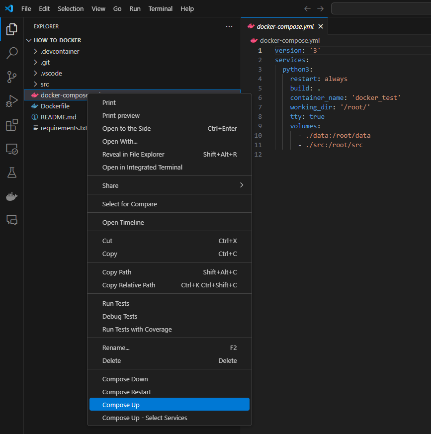
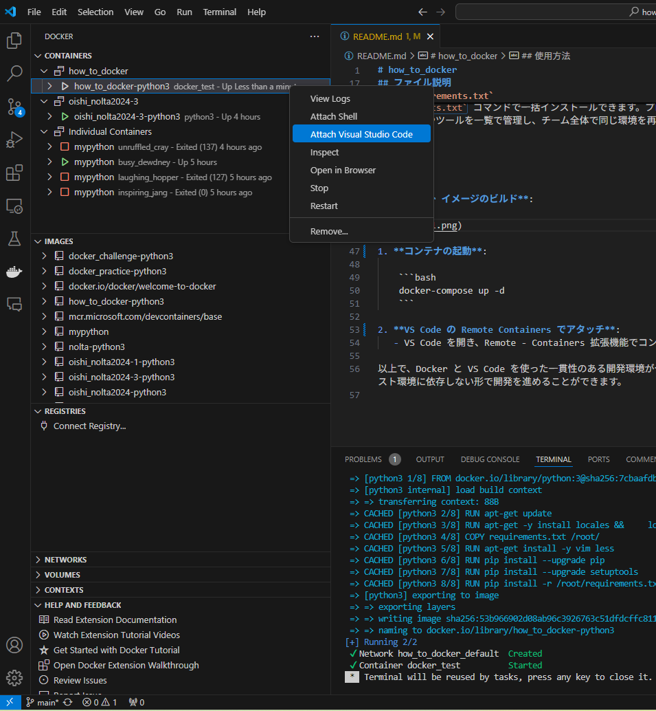
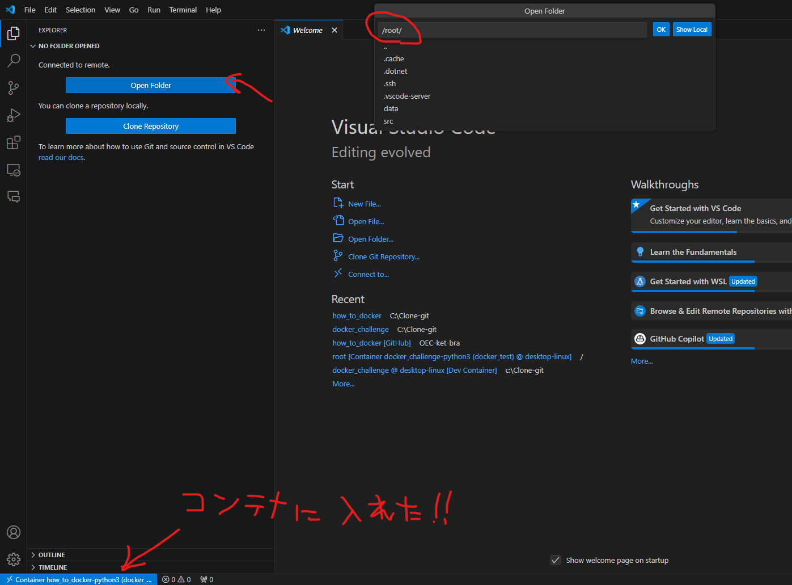
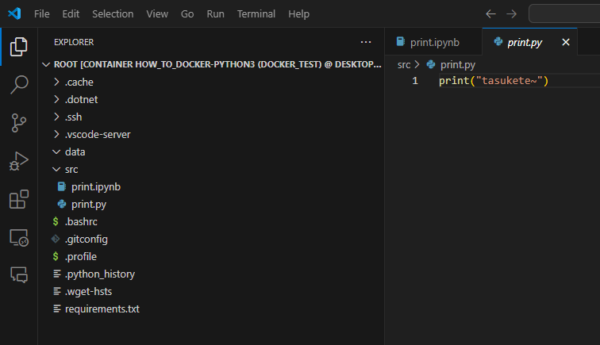

# how_to_docker

dockerとvscodeの連携いろいろ

---

## プロジェクト構成

```
├── .devcontainer/       # VS Code の Remote Containers 設定
├── .vscode/             # VS Code のプロジェクト設定
├── Dockerfile           # コンテナのビルド設定
├── docker-compose.yml   # 複数のコンテナ設定を管理
├── requirements.txt     # Python の依存関係リスト
```

## ファイル説明

### `.devcontainer/`

VS Code の [Remote - Containers](https://code.visualstudio.com/docs/remote/containers) 機能に関連する設定ファイルが含まれています。このフォルダ内には `devcontainer.json` ファイルがあり、使用する Docker イメージ、拡張機能、初期コマンドなどを指定します。

### `.vscode/`

VS Code のプロジェクト固有の設定が含まれるフォルダです。エディタの設定、推奨される拡張機能、デバッグ設定などが含まれ、開発チーム全体で統一された開発環境を提供します。

### `Dockerfile`

Docker イメージをビルドするための設定ファイルです。ベースイメージの選択、必要なパッケージのインストール、環境変数の設定など、コンテナ環境を構築するための手順が記述されています。

### `docker-compose.yml`

複数のコンテナサービスを簡単に定義・管理するための設定ファイルです。サービス間のネットワークやボリューム設定を行い、アプリケーション全体の構成を記述します。このプロジェクトでは、開発コンテナのセットアップと一括管理に使用します。

### `requirements.txt`

Python の依存パッケージを記載したファイルです。`pip install -r requirements.txt` コマンドで一括インストールできます。プロジェクトで使用するライブラリやツールを一覧で管理し、チーム全体で同じ環境を再現できます。

---

## 使用方法

1. **Docker イメージのビルド**:
   - docker-compose.ymlのcontainer_nameを適当な名前に変更
   - docker-compose.yml (右クリ) -> Compose up
    

2. **コンテナにアタッチ**:
   - Dockerアイコン（くじらのやつ）-> ビルドしたコンテナ（右クリ）-> Attach VSCode
    

3. **コンテナ内でディレクトリを開く**:
   - 新しいVScodeのウインドウが作れたら、Open Folder -> ./root をwdとして開く
   

4. **開発開始！**:
   - srcの中のコードを試したり、コードを書いたりしてみましょう
   

requirements.txtからパッケージを追加したり、コンテナを停止・再起動・removeしたり、docker-compose.ymlからvolumeするディレクトリを変えたりして遊んでみましょう

